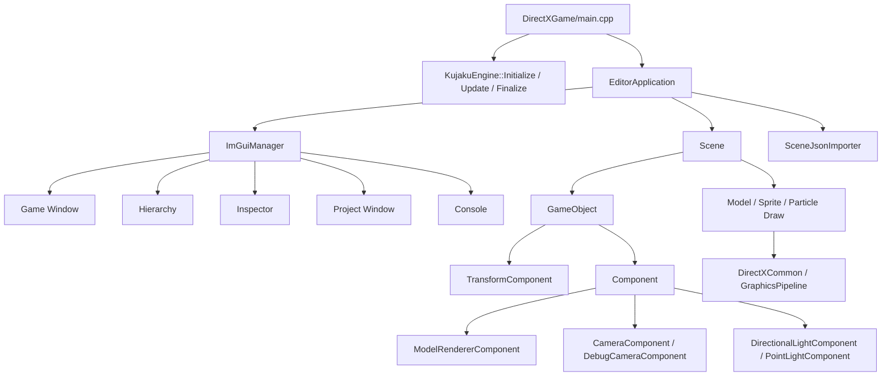

# KujakuEngine

KujakuEngine は、DirectX 12 の描画基盤に、ImGui Docking を使った簡易エディタ、Unity 風の `Scene` / `GameObject` / `Component` 構造、JSON による Scene 保存・復元、Project Window、Transform Gizmo を追加した学習・制作向けの C++ エンジンです。

現在の設計では、`main.cpp` はできるだけ薄くし、Editor / Play の制御は `EditorApplication`、ゲーム内の Object 管理は `Scene`、個別の振る舞いは `Component` に寄せています。

## 目次

- [必要環境](#必要環境)
- [起動方法](#起動方法)
- [全体構造](#全体構造)
- [実行フロー](#実行フロー)
- [Editor の使い方](#editor-の使い方)
- [Play / Edit の仕様](#play--edit-の仕様)
- [Scene / GameObject / Component](#scene--gameobject--component)
- [標準 Component](#標準-component)
- [Collider / Layer / LayerMask](#collider--layer--layermask)
- [アニメーション](#アニメーション)
- [Scene JSON 保存と復元](#scene-json-保存と復元)
- [Game Window 選択と Transform Gizmo](#game-window-選択と-transform-gizmo)
- [Camera / Light の扱い](#camera--light-の扱い)
- [Input](#input)
- [Model / Texture / 描画](#model--texture--描画)
- [Project Window](#project-window)
- [DLL Hot Reload](#dll-hot-reload)
- [新しい Component の作り方](#新しい-component-の作り方)
- [新しい Scene の作り方](#新しい-scene-の作り方)
- [主要ファイル一覧](#主要ファイル一覧)
- [実装時の注意](#実装時の注意)
- [よくある問題](#よくある問題)

## 必要環境

- Windows
- Visual Studio 2022 以降
- C++20 相当のコンパイラ
- DirectX 12
- x64 / Debug または x64 / Release

外部ライブラリは `DirectXGame/externals` 配下に置かれています。

- Dear ImGui docking
- ImGuizmo
- DirectXTex
- nlohmann/json
- Assimp

Assimp を使うモデル読み込みでは、プロジェクト側と Assimp 側の Runtime Library 設定を揃える必要があります。現在は DLL Hot Reload で Engine と GameModule がメモリをまたぐため、Debug は `/MDd` と `assimp-vc143-mdd.lib`、Release は `/MD` と `assimp-vc143-md.lib` に揃えています。

## 起動方法

1. `KujakuEngine.sln` を Visual Studio で開きます。
2. 構成を `Debug`、プラットフォームを `x64` にします。
3. スタートアッププロジェクトを `DirectXGame` にします。
4. 実行します。

エントリーポイントは `DirectXGame/main.cpp` です。

```cpp
int WINAPI WinMain(HINSTANCE, HINSTANCE, LPSTR, int) {
	KujakuEngine::Initialize(L"Kujaku Engine");

	EditorApplication* editorApplication = EditorApplication::GetInstance();
	editorApplication->Initialize();

	while (KujakuEngine::Update()) {
		editorApplication->BeginFrame();
		editorApplication->Update();
		editorApplication->Draw();
		editorApplication->EndFrame();
	}

	editorApplication->Finalize();
	KujakuEngine::Finalize();
	return 0;
}
```

`main.cpp` は `EditorApplication` を呼ぶだけに近い形になっています。Edit / Play の分岐や、Scene の Update を流すかどうかの判断は `main.cpp` には置かない方針です。現在の Scene は `EditorApplication` が `GameModule.dll` を読み込み、DLL 側の `CreateGameScene()` から作成します。

## 全体構造



責務は次のように分けています。

| 層 | 主な役割 |
| --- | --- |
| `main.cpp` | エンジン初期化、EditorApplication 呼び出し、終了処理 |
| `KujakuEngine` | WinApp、DirectXCommon、Input、Time、TextureManager などの初期化と毎フレーム更新 |
| `EditorApplication` | EditorMode、Start / Stop、Scene 所有、Play 中だけ Scene Update を流す判断 |
| `ImGuiManager` | ImGui 初期化、DockSpace、各 Editor Window、ショートカット、Gizmo、Game Window 表示 |
| `Scene` | GameObject 一覧の所有、Update / Draw / Finalize の入口 |
| `GameObject` | 名前、Active、必須 Transform、Component 一覧 |
| `Component` | GameObject に追加する振る舞い、Inspector、JSON 保存・復元 |
| `DirectXCommon` | DX12 Device、SwapChain、Command、Descriptor、Game 用 RenderTarget |

## 実行フロー

### 起動時

1. `KujakuEngine::Initialize()` が呼ばれます。
2. `WinApp` がウィンドウを作成します。
3. `DirectXCommon` が DX12、SwapChain、Game 用 RenderTarget を初期化します。
4. `ImGuiManager` が ImGui を初期化します。
5. `GraphicsPipeline`、Light、TextureManager、Input、Random、Time などを初期化します。
6. `EditorApplication::Initialize()` が呼ばれ、EditorMode を `Edit` にします。
7. `GameModule.dll` を一時コピーして読み込みます。
8. `RegisterGameComponents()` で DLL 側 Component を `ComponentFactory` に登録します。
9. `CreateGameScene()` で DLL 側 Scene を作成します。
10. `SampleScene::Initialize()` で初期 GameObject を作ります。
11. `SceneJsonImporter` が `SceneJson` を探し、保存済み JSON があれば Scene に適用します。

### 毎フレーム

```cpp
while (KujakuEngine::Update()) {
	editorApplication->BeginFrame();
	editorApplication->Update();
	editorApplication->Draw();
	editorApplication->EndFrame();
}
```

各関数の中身は次のような役割です。

| 関数 | 役割 |
| --- | --- |
| `KujakuEngine::Update()` | Windows メッセージ、Input、Time を更新 |
| `EditorApplication::BeginFrame()` | ImGui のフレーム開始 |
| `EditorApplication::Update()` | Editor UI を描画し、Play 中だけ `currentScene_->Update()` |
| `EditorApplication::Draw()` | Game 用 RenderTarget に Scene を描画 |
| `EditorApplication::EndFrame()` | ImGui 描画、SwapChain Present、Fence 待機 |

## Editor の使い方

起動すると ImGui Docking ベースの Editor が表示されます。

| Window | 役割 |
| --- | --- |
| `Scene` | 編集用ビューです。DebugCamera で自由に見回し、選択中 Collider のワイヤー表示や Gizmo 操作を行います。 |
| `Game` | ゲーム描画結果を表示します。Play 中は Main Camera を使います。 |
| `Hierarchy` | Scene 内の GameObject 一覧を表示します。選択状態は Inspector と同期します。D&D で親子化・並び替えができます。 |
| `Inspector` | 選択中 GameObject の名前、Active、Component を編集します。 |
| `Project` | `DirectXGame` 配下のファイルを閲覧します。画像・モデルはプレビューできます。 |
| `Console` | Editor の Start / Stop、JSON 保存・読込などのログを表示します。 |
| `Performance` | フレーム時間などの計測情報を表示します。 |
| `Animation` | キーフレームアニメーションの編集ウィンドウです。詳細は [アニメーション](#アニメーション)。 |

各ウィンドウは `Window` メニューから表示 / 非表示を切り替えられます。

### 基本操作

| 操作 | 内容 |
| --- | --- |
| `Start` ボタン | Edit から Play に移行します。 |
| `Stop` ボタン | Play から Edit に戻ります。 |
| `Ctrl + S` | 現在の Scene を JSON として保存します。 |
| `Ctrl + Shift + R` | Game DLL を再読み込みします。Play 中は実行できません。 |
| Hierarchy の左クリック | GameObject を選択します。 |
| Game Window の左クリック | Edit 中だけ、描画されている GameObject を選択します。 |
| Hierarchy の右クリック | `Entity`、`Cube`、`Sphere` を作成できます。 |
| Inspector の `Add Component` | 登録済み Component を追加できます。 |
| Project Window の右クリック | `Copy File Path`、`Show in Explorer` を実行できます。 |

## Play / Edit の仕様

EditorMode は `EditorApplication` が管理します。

```cpp
enum class EditorMode {
	Edit,
	Play,
};
```

現在の仕様は次の通りです。

| 状態 | Scene Update | Scene Draw | Camera |
| --- | --- | --- | --- |
| Edit | 呼ばない | 呼ぶ | Editor Debug Camera |
| Play | 呼ぶ | 呼ぶ | Main Camera |

`EditorApplication::Update()` では次の考え方で制御しています。

```cpp
void EditorApplication::Update() {
	ImGuiManager::GetInstance()->DrawEditor();

	if (ShouldUpdateGame() && currentScene_) {
		currentScene_->Update();
	}
}
```

`ShouldUpdateGame()` は現在 `IsPlaying()` を返します。将来的に Scene Clone を実装する場合も、この入口を拡張する想定です。

### Start / Stop

`Start()` は Play に入り、Scene と GameObject と Component の `OnPlayStart()` を呼びます。

`Stop()` は Edit に戻り、`OnPlayStop()` を呼びます。

`TransformSnapshotComponent` を付けた GameObject は、Play 開始時の Transform を保存し、Stop 時に復元できます。ただし、現時点では Unity のような完全な PlayScene Clone はまだ実装していません。

## Scene / GameObject / Component

### Scene

`Scene` は GameObject 一覧を所有し、Update / Draw の入口になります。

```cpp
class Scene {
public:
	virtual void Initialize();
	virtual void Update();
	virtual void Draw();
	virtual void Finalize();

	GameObject* CreateGameObject(const std::string& name = "GameObject");
	GameObject* AddGameObject(std::unique_ptr<GameObject> gameObject);

	std::vector<std::unique_ptr<GameObject>>& GetGameObjects();
};
```

`main.cpp` や `EditorApplication` が個別の Player、Enemy、Model を直接 Update / Draw するのではなく、外側は Scene の入口だけを呼びます。

```cpp
if (ShouldUpdateGame() && currentScene_) {
	currentScene_->Update();
}

if (currentScene_) {
	currentScene_->Draw();
}
```

### GameObject

`GameObject` は Scene 上に存在する Object の最小単位です。

主な情報は次の通りです。

| 情報 | 内容 |
| --- | --- |
| `name_` | Hierarchy / Inspector に表示する名前 |
| `active_` | 無効化された GameObject は Update / Draw 対象外 |
| `TransformComponent` | 必須 Component。削除不可 |
| `components_` | `std::vector<std::unique_ptr<Component>>` で所有する Component 一覧 |

`GameObject` は必ず `TransformComponent` を持ちます。Inspector 上でも `Transform` は他の Component と同じ階層で表示されます。

```text
Transform
ModelRendererComponent
RotatorComponent
```

### Component

`Component` は GameObject に追加する振る舞いの基底クラスです。

```cpp
class Component {
public:
	virtual void Initialize() {}
	virtual void Update() {}
	virtual void Draw() {}
	virtual const char* GetTypeName() const { return "Component"; }
	virtual void DrawInspector() {}
	virtual void WriteJson(nlohmann::json& json) const {}
	virtual void ReadJson(const nlohmann::json& json) {}
	virtual void OnAfterReadJson() {}
	virtual void OnPlayStart() {}
	virtual void OnPlayStop() {}

	virtual bool CanRemove() const { return true; }
	virtual bool AllowMultiple() const { return true; }
};
```

Component は次の目的を持ちます。

- `Update()` で Play 中の挙動を作る。
- `Draw()` で描画処理を行う。
- `DrawInspector()` で Inspector の編集 UI を出す。
- `WriteJson()` / `ReadJson()` で保存・復元する。
- `OnPlayStart()` / `OnPlayStop()` で Play 開始・終了時の処理を行う。

## 標準 Component

現在登録されている標準 Component は `DirectXGame/GameModule/GameModule.cpp` の `RegisterGameComponents()` で登録されています。実装ファイルは `DirectXGame/KujakuEngine/components` にありますが、ビルド対象は `GameModule.vcxproj` 側です。そのため、標準 Component の実装変更も `GameModule.dll` をビルドして `Reload DLL` すれば反映されます。

| Component | 役割 |
| --- | --- |
| `Transform` | GameObject の位置、回転、スケールを持つ必須 Component。削除不可、複数追加不可。 |
| `ModelRendererComponent` | `Model` を GameObject の Transform で描画します。Cube / Sphere / Capsule / Model / Custom を扱います。Texture / Color は Material 側で管理します。 |
| `CameraComponent` | GameObject の Transform を Camera に反映します。 |
| `DebugCameraComponent` | Edit 中の DebugCamera 操作を GameObject の Transform と Camera に反映します。 |
| `DirectionalLightComponent` | DirectionalLight の GPU データを GameObject 上で管理します。 |
| `PointLightComponent` | GameObject の Transform 位置を PointLight に反映します。 |
| `RigidbodyComponent` | 簡易物理(重力・速度・衝突応答)を担当します。 |
| `SphereColliderComponent` | 球形の当たり判定です。GameObject の Layer と Collider の Collision Mask で接触対象を制御できます。 |
| `BoxColliderComponent` | 箱形の当たり判定です。WorldRotation がゼロなら AABB、少しでも回転があれば OBB として判定します。 |
| `CapsuleColliderComponent` | カプセル形の当たり判定です。Unity 準拠の Radius / Height / Direction(X/Y/Z) を持ちます。 |
| `AnimatorComponent` | AnimationClip(*.anim.json) を再生し、同じ GameObject の Component プロパティへ書き込みます。詳細は [アニメーション](#アニメーション)。 |
| `CanvasComponent` / `RectTransformComponent` / `ImageComponent` / `TextComponent` / `ButtonComponent` | Unity Canvas 風のスクリーン空間 UI を構成します。 |
| `RotatorComponent` | 所有 GameObject を回転させるサンプル Component です。 |
| `TransformSnapshotComponent` | Play 開始時の Transform を保存し、Stop 時に戻します。 |

Inspector の `Add Component` メニューには、`ComponentFactory` に登録された Component 名が表示されます。

## Collider / Layer / LayerMask

Collider は `SphereColliderComponent` / `BoxColliderComponent` / `CapsuleColliderComponent` を GameObject に追加して使います。`ColliderComponent` 自体は基底クラスなので、Inspector から追加する対象は Sphere / Box / Capsule のいずれかです。

`CapsuleColliderComponent` は Unity 準拠で `Radius` / `Height`(両端の半球を含む全長) / `Direction`(X/Y/Z 軸) を持ちます。判定は Sphere と Capsule を「カプセル(球は退化カプセル)」として統一的に扱い、capsule-sphere / capsule-capsule / capsule-Box(OBB) に対応しています。

### Layer

`Layer` は GameObject 側にある 0 から 31 の番号です。Inspector の GameObject 情報にある `Layer` で編集できます。Collider は Owner の GameObject の Layer を、自分の所属 Layer として扱います。

内部では `1u << layer` のビットとして扱います。例えば `Layer = 3` の GameObject は `0b00001000` の所属ビットになります。

### Collision Mask

`Collision Mask` は Collider 側にある値で、「どの Layer の相手と接触するか」をビットで指定します。

| 値 | 意味 |
| --- | --- |
| `-1` | 全 Layer と接触します。内部値は `0xffffffff` です。 |
| `0` | どの Layer とも接触しません。 |
| `1 << 0` | Layer 0 の相手だけ接触します。 |
| `1 << 3` | Layer 3 の相手だけ接触します。 |
| `(1 << 0) | (1 << 3)` | Layer 0 と Layer 3 の相手と接触します。 |

接触するには、片方だけでなく両方の Mask が相手の Layer を許可している必要があります。

```cpp
// Player を Layer 0、Enemy を Layer 1 として扱う例
player->SetLayer(0);
enemy->SetLayer(1);

SphereColliderComponent* playerCollider = player->AddComponent<SphereColliderComponent>();
BoxColliderComponent* enemyCollider = enemy->AddComponent<BoxColliderComponent>();

playerCollider->SetCollisionMask(1u << 1); // Player は Enemy Layer と接触する
enemyCollider->SetCollisionMask(1u << 0);  // Enemy は Player Layer と接触する
```

上の例で `enemyCollider->SetCollisionMask(0);` にすると、Player 側が Enemy を許可していても、Enemy 側が Player を許可していないため接触しません。

### Trigger と Collision Event

Collider の `Is Trigger` を有効にすると、接触時は `OnTriggerEnter` / `OnTriggerStay` / `OnTriggerExit` が呼ばれます。通常 Collider 同士なら `OnCollisionEnter` / `OnCollisionStay` / `OnCollisionExit` が呼ばれます。

どちらの場合も Layer / Collision Mask の判定を通過した組み合わせだけが対象です。

### BoxCollider の AABB / OBB

`BoxColliderComponent` は、Owner の WorldRotation がすべてゼロなら AABB として判定します。少しでも回転がある場合は OBB として判定します。

そのため、回転していない床や壁は軽い AABB 判定、回転した箱や斜めの障害物は OBB 判定として扱えます。

### Collider のデバッグ可視化

Edit 中に DebugCamera で表示しているときだけ、選択中 GameObject の Collider が `LineRenderer` で可視化されます。選択していない Object の Collider は表示されません。

Sphere は緯度・経度のライン、Box は AABB または OBB のワイヤー、Capsule は両端のリング + 半球の弧 + 側面ラインで表示します。可視化は判定形状の確認用で、Play 中の Main Camera 表示では描画しません。

## アニメーション

Unity の Animation Window に近いキーフレームアニメーション機能です。クリップは `*.anim.json` として Project 管理し、`AnimatorComponent` が再生します。

### データ構造

| 要素 | 内容 |
| --- | --- |
| `AnimationClipData` | クリップ本体。名前、WrapMode、トラック一覧を持ちます。`*.anim.json` として保存します。 |
| `AnimationTrack` | float 1 チャンネル分のトラック。path は `"ComponentTypeName/チャンネル名"` 形式です(例 `Transform/translation.y`)。 |
| `AnimationCurve` | キー配列と補間。cubic Hermite(タンジェント)補間、またはキーごとのイージング指定で評価します。 |
| `AnimationKeyframe` | `time` / `value` / `inTangent` / `outTangent` / `easing` を持ちます。 |

Vector3 のプロパティは `.x` / `.y` / `.z` の 3 トラック、色(Vector4)は 4 トラックに分解されます(Unity と同じ方式)。

### AnimatorComponent の再生関連関数

```cpp
AnimatorComponent* animator = gameObject->AddComponent<AnimatorComponent>();

// クリップの追加・選択
animator->SetClipPath("Animations/Sample.anim.json"); // リストへ追加して選択(既存なら選択のみ)
animator->SetCurrentClipIndex(1);                     // index で切替(読み込みも行う)
animator->RemoveClipAt(0);                            // リストから参照を外す

// 再生制御
animator->Play();                  // 選択中クリップを先頭から再生
animator->PlayByName("Walk");      // クリップ名(クリップJSONのname)で検索して切替+再生
animator->Stop();                  // 停止
bool playing = animator->IsPlaying();

// 時刻の直接操作
animator->SetTime(0.5f);           // 再生位置を変更
float time = animator->GetTime();
animator->EvaluateAt(0.5f);        // 指定時刻の値を即座にプロパティへ書き込む(スクラブ用)

// その他
animator->GetClip();               // 読み込み済み AnimationClipData への参照
animator->SaveClip(message);       // 現在のクリップをアセットへ保存
animator->ResolveBindings();       // Component 構成変更後にバインディングを再解決
```

Inspector では `Play On Start`(Play 開始時に自動再生)と `Speed`(再生速度倍率)、クリップ一覧の切替を編集できます。再生は Play 中に `Update()` 内で `Time::GetDeltaTime() * speed` だけ進みます。

### WrapMode

クリップ終端の挙動はクリップ側の `wrapMode` で指定します。

| WrapMode | 挙動 |
| --- | --- |
| `Once` | 終端で停止します。 |
| `Loop` | 先頭へ戻って繰り返します。 |
| `PingPong` | 終端と先頭を往復します。 |

### キーフレーム対象のプロパティ

トラックが書き込める対象は次の通りです。

- `Transform`: `translation` / `rotation` / `scale` の 9 チャンネル(専用対応)。
- `KUJAKU_SERIALIZED_FIELDS` マクロで登録している Component の float / Vector3 / Vector4 フィールド(自動対応)。

手書き Inspector の Component をキーフレーム対応させるには `Component::CollectAnimatableChannels()` を override してチャンネルを列挙します。

### Animation Window

`Window` メニュー → `Animation` で開きます。選択中 GameObject の Animator のクリップを編集します。

| 機能 | 操作 |
| --- | --- |
| クリップ切替 | 上部のコンボで選択。`[+]` で新規クリップ作成。Project から `.anim.json` を D&D でも追加できます。 |
| 表示切替 | `Dopesheet`(キー一覧) / `Curves`(カーブエディタ)。 |
| スクラブ | ルーラーをドラッグ。`Preview` ON で実際のオブジェクトに反映されます(OFF で完全に巻き戻し)。 |
| キー追加 | 行のダブルクリック、トラック右クリック `Add Key At Playhead`、`Key All`(全トラック)。 |
| キー編集 | ドラッグで時刻移動(0.01s スナップ)。右クリックで `Copy Key` / `Delete Key`。トラック右クリック `Paste Key At Playhead` で貼り付け。 |
| イージング | キー右クリック → タンジェント系プリセット(`Smooth` / `Linear` / `Flat` / `Constant`)、または `Easing (to Next Key)` から easings.net 準拠の 30 種(Sine / Quad / Cubic / Quart / Quint / Expo / Circ / Back / Elastic / Bounce × In / Out / InOut)を区間へ適用。 |
| カーブ編集 | `Curves` ビューはイージング編集専用です。キーの値は変更できず、タンジェントハンドルのドラッグと時刻移動のみ行えます。 |
| 録画 | `[Rec]` で録画モード(Inspector が赤くなります)。Inspector で値を変更すると、プレイヘッド時刻へ自動でキーが登録されます。録画中でなくてもフィールド右クリック → `Add Keyframe` でキーを打てます。 |
| 保存 | `Save Clip` でアセットへ書き出します(編集はメモリ上で行われ、保存するまでファイルは変わりません)。 |

## Scene JSON 保存と復元

### 保存操作

`Ctrl + S` で現在の Scene を JSON として保存します。Export 専用ボタンは使わず、Editor ショートカットとして処理しています。

実装場所は `ImGuiManager::HandleEditorShortcuts()` と `ImGuiManager::ExportCurrentSceneJson()` です。

```cpp
if (io.KeyCtrl && ImGui::IsKeyPressed(ImGuiKey_S, false)) {
	ExportCurrentSceneJson();
}
```

### 保存先

ProjectDir は通常 `DirectXGame` です。保存先は次の構造になります。

```text
DirectXGame/
  SceneJson/
    SampleScene/
      SampleScene.scene.json
      GameObjects/
        0000_Main Camera.gameobject.json
        0001_Editor Debug Camera.gameobject.json
        0002_Directional Light.gameobject.json
        0003_Point Light.gameobject.json
        0004_MonsterBall.gameobject.json
        ...
```

`.meta` ファイルは現在生成しません。以前は Unity の meta 風ファイルを検討していましたが、現状のエンジンでは参照解決に使っていないため、生成処理は削除しています。

### Scene JSON

Scene 側の JSON は、GameObject JSON への参照を持ちます。

```json
{
  "assetType": "Scene",
  "name": "SampleScene",
  "gameObjects": [
    {
      "name": "MonsterBall",
      "assetPath": "SceneJson/SampleScene/GameObjects/0004_MonsterBall.gameobject.json"
    }
  ]
}
```

### GameObject JSON

GameObject 側の JSON は、名前、Active、Component 一覧を持ちます。

```json
{
  "assetType": "GameObject",
  "name": "MonsterBall",
  "active": true,
  "components": [
    {
      "type": "Transform",
      "enabled": true,
      "properties": {
        "scale": [1.0, 1.0, 1.0],
        "rotation": [0.0, 0.0, 0.0],
        "translation": [0.0, -2.0, 0.0]
      }
    },
    {
      "type": "ModelRendererComponent",
      "enabled": true,
      "properties": {
        "primitive": "Sphere",
        "texture": "resources/monsterBall.png",
        "modelPath": "player"
      }
    }
  ]
}
```

### 起動時の復元

`EditorApplication` は起動時に `GameModule.dll` の `CreateGameScene()` で Scene を作成し、Scene 初期化後に `SceneJsonImporter::ImportScene()` を呼びます。

```cpp
currentScene_ = api.CreateScene();
if (currentScene_) {
	currentScene_->Initialize();
	SceneJsonImporter::ImportScene(*currentScene_, DetectEditorProjectRoot());
}
```

保存済み JSON が存在する場合は、起動時にその内容が Scene へ適用されます。

Import の特徴は次の通りです。

- Scene 名から `SceneJson/<SceneName>/<SceneName>.scene.json` を探します。
- GameObject はまず名前一致で既存 Object に適用します。
- 一致しない場合は index を見ます。
- それでも存在しない場合は新規 GameObject を作ります。
- JSON にない削除可能 Component は削除されます。
- JSON にない GameObject は削除されます。
- Transform は必須 Component として扱い、削除しません。
- Component は `ComponentFactory` に登録された型名から生成されます。

## Game Window 選択と Transform Gizmo

### Game Window のアスペクト比

Game Window は Game 用 RenderTarget を `ImGui::Image` で表示しています。表示領域の縦横比が RenderTarget と合わない場合は、黒帯を描画して中央に表示します。

```cpp
drawList->AddRectFilled(contentPosition, contentEnd, IM_COL32(0, 0, 0, 255));
drawList->AddImage(static_cast<ImTextureID>(handle.ptr), imagePosition, imageEnd);
```

マウス座標や Gizmo の矩形も、黒帯を除いた実際の `imagePosition` / `imageSize` を基準に計算しています。そのため、ウィンドウ最大化時でも Game Window 上の判定がずれにくい構造です。

### GameObject のクリック選択

Edit 中に Game Window を左クリックすると、描画中の GameObject を選択できます。

Editor 側の入口は `ImGuiManager::HandleGameWindowObjectSelection()` です。実際の Ray 作成と Scene へのヒット判定は `scene/RayCast.h/.cpp` に分離しているため、ゲーム中の処理からも同じ仕組みを使えます。

```cpp
Ray ray{};
if (RayCast::CreateRayFromViewportPoint(point, viewportPosition, viewportSize, camera, ray)) {
	RayCastHit hit{};
	if (RayCast::Cast(scene, ray, hit)) {
		GameObject* selected = hit.gameObject;
	}
}
```

処理の流れは次の通りです。

1. Play 中なら選択しません。
2. Game Window 上のクリックか確認します。
3. ImGuizmo 操作中なら選択しません。
4. `RayCast::CreateRayFromViewportPoint()` でマウス座標を Camera 基準の Ray に変換します。
5. `RayCast::Cast()` で Scene 内の GameObject を走査します。
6. Active な `GameObject` だけを対象にします。
7. `ModelRendererComponent` を持つ Object だけを対象にします。
8. Model の頂点からローカル AABB を作ります。
9. `Model::GetRootLocalMatrix()` と GameObject Transform を合わせて World 行列を作ります。
10. Ray と AABB の交差判定を行い、最も近い Object を `RayCastHit` として返します。

選択状態は `EditorSelection` が持ちます。Hierarchy と Inspector は同じ `EditorSelection` を見ているため、Game Window で選んだ Object は Hierarchy 側でも選択中に見えます。

### Transform Gizmo

Transform Gizmo は ImGuizmo を使っています。

| モード | アイコン |
| --- | --- |
| Translate | `resources/images/icon_guizmo_translate.png` |
| Rotate | `resources/images/icon_guizmo_rotate.png` |
| Scale | `resources/images/icon_guizmo_scale.png` |

`DrawTransformGizmo()` は選択中 GameObject の `TransformComponent` を取得し、ImGuizmo の操作結果を `WorldTransform` の `translation_`、`rotation_`、`scale_` に戻します。

```cpp
WorldTransform& transform = transformComponent->GetTransform();
Matrix4x4 gizmoMatrix = MakeAffineMatrix(transform.scale_, transform.rotation_, transform.translation_);

ImGuizmo::Manipulate(
	MatrixData(camera->matView),
	MatrixData(camera->matProjection),
	operation,
	ImGuizmo::LOCAL,
	MatrixData(gizmoMatrix));
```

Scale は 0 に近づきすぎると描画や行列計算が壊れやすいため、最小値を `0.001f` に補正しています。

## Camera / Light の扱い

Camera、DebugCamera、DirectionalLight、PointLight は GameObject + Component として扱います。

`SampleScene::EnsureSceneServiceObjects()` が、標準サービス Object を存在確認し、なければ作成します。

| GameObject | Component | 役割 |
| --- | --- | --- |
| `Main Camera` | `CameraComponent` | Play 中の表示 Camera |
| `Editor Debug Camera` | `CameraComponent` + `DebugCameraComponent` | Edit 中の表示 Camera |
| `Directional Light` | `DirectionalLightComponent` | 平行光源 |
| `Point Light` | `PointLightComponent` | 点光源 |

Edit 中は `Editor Debug Camera` を使い、Play 中は `Main Camera` を使います。

```cpp
if (EditorApplication::GetInstance()->IsPlaying()) {
	currentViewCameraComponent_ = gameCameraComponent_;
} else {
	editorDebugCameraComponent_->UpdateEditorCamera();
	currentViewCameraComponent_ = editorCameraComponent_;
}
```

Light は `SampleScene::ApplySceneLights()` で Scene 内 Component を走査し、GPU 側の Light 管理クラスへ反映します。

## Input

`Input`(`input/Input.h`)はキーボード・マウス・コントローラーの入力をまとめる静的クラスです。キーボード / マウスは DirectInput、コントローラーは XInput(最大 4 台)を使います。

初期化と毎フレーム更新はエンジン側(`KujakuEngine::Initialize()` / `Update()`)が行うため、利用側は取得系の関数を呼ぶだけです。全メソッドが `KUJAKU_API` で公開されており、GameModule 側の Component からもそのまま呼べます。

### キーボード

キーコードは DirectInput の `DIK_*` を使います。

```cpp
if (Input::GetKey(DIK_W)) {}        // 押している間
if (Input::GetKeyTrigger(DIK_SPACE)) {} // 押した瞬間だけ
if (Input::GetKeyRelease(DIK_SPACE)) {} // 離した瞬間だけ
```

### マウス

```cpp
if (Input::GetClick(0)) {}          // 左ボタンを押している間(0=左, 1=右, 2=中)
if (Input::GetClickTrigger(0)) {}   // 押した瞬間
Vector2 pos = Input::GetMouseClientPos(); // クライアント座標
```

### コントローラー

`padNo` は 0〜3 で、省略時は 0(1P)です。

```cpp
// 接続確認
if (Input::IsControllerConnected()) {}

// ボタン(XINPUT_GAMEPAD_* を渡す)
if (Input::GetControllerButton(XINPUT_GAMEPAD_A)) {}        // 押している間
if (Input::GetControllerButtonTrigger(XINPUT_GAMEPAD_A)) {} // 押した瞬間
if (Input::GetControllerButtonRelease(XINPUT_GAMEPAD_A)) {} // 離した瞬間

// スティック(-1.0〜1.0 に正規化・円形デッドゾーン適用済み)
Vector2 leftStick = Input::GetLeftStick();
Vector2 rightStick = Input::GetRightStick();

// トリガー(0.0〜1.0 に正規化。L2 / R2 に相当)
float l2 = Input::GetLeftTrigger();
float r2 = Input::GetRightTrigger();
```

主なボタン定数(XInput)と PlayStation 系の対応は次の通りです。

| XInput 定数 | Xbox | PlayStation 相当 |
| --- | --- | --- |
| `XINPUT_GAMEPAD_A` | A | ×(クロス) |
| `XINPUT_GAMEPAD_B` | B | ○(サークル) |
| `XINPUT_GAMEPAD_X` | X | □(スクエア) |
| `XINPUT_GAMEPAD_Y` | Y | △(トライアングル) |
| `XINPUT_GAMEPAD_LEFT_SHOULDER` | LB | L1 |
| `XINPUT_GAMEPAD_RIGHT_SHOULDER` | RB | R1 |
| `XINPUT_GAMEPAD_LEFT_THUMB` | 左スティック押し込み | L3 |
| `XINPUT_GAMEPAD_RIGHT_THUMB` | 右スティック押し込み | R3 |
| `XINPUT_GAMEPAD_DPAD_UP` など | 十字キー | 十字キー |
| `XINPUT_GAMEPAD_START` / `BACK` | Menu / View | OPTIONS / SHARE |

L2 / R2(LT / RT)はボタンではなく**アナログ値**なので、`GetLeftTrigger()` / `GetRightTrigger()` を使います。ボタンのように扱いたい場合は、しきい値と前フレーム比較でエッジ検出します。

```cpp
// R2を「押した瞬間」として扱う例(GameComponents/PlayerAnimator.cpp と同じ方式)
bool isPressed = Input::GetRightTrigger() >= 0.5f;
if (isPressed && !wasPressed_) {
	// 押した瞬間の処理
}
wasPressed_ = isPressed;
```

正規化の仕様は次の通りです。

- スティック: 生値を -1.0〜1.0 へ変換し、XInput 標準のデッドゾーン(`XINPUT_GAMEPAD_LEFT/RIGHT_THUMB_DEADZONE`)を**円形**に適用します。デッドゾーン内は `(0, 0)` になります。
- トリガー: 生値(0〜255)を 0.0〜1.0 へ変換します。`XINPUT_GAMEPAD_TRIGGER_THRESHOLD` 未満は 0.0 になります。

### 使用中の入力デバイス種別

最後に操作されたデバイスを判定できます。操作ガイド UI の表示切り替え(キーボード表記 ⇔ パッド表記)などに使えます。

```cpp
if (Input::IsControllerInput()) {
	// パッド用の操作ガイドを表示
} else if (Input::IsKeyboardMouseInput()) {
	// キーボード / マウス用の操作ガイドを表示
}
```

### 利用例: PlayerAnimator

`GameComponents/PlayerAnimator` は、R2 でアニメーションを再生するゲーム Component の実例です。トリガーのしきい値判定、エッジ検出、`AnimatorComponent` の `Play()` / `PlayByName()` 呼び出しの参考になります。

## Model / Texture / 描画

### Model

`Model` は 3D モデルの頂点バッファ、マテリアル、テクスチャ、描画処理を持ちます。

主な生成関数は次の通りです。

```cpp
Model* model = Model::CreateFromOBJ("player", ShaderModel::kBlingPhongReflection);
Model* gltf = Model::CreateFromGlTF("plane", ShaderModel::kBlingPhongReflection);
Model* cube = Model::CreateCube("resources/monsterBall.png", ShaderModel::kBlingPhongReflection);
Model* sphere = Model::CreateSphere("resources/monsterBall.png", ShaderModel::kBlingPhongReflection);
Model* capsule = Model::CreateCapsule("resources/white1x1.png", ShaderModel::kBlingPhongReflection); // radius=0.5, height=2.0 のカプセル
```

`ModelUtil` は Assimp を使って OBJ / glTF などを読み込み、エンジン内部の `ModelData` へ変換します。Assimp 読み込み時は三角形化を前提にしており、四角形や多角形を含むモデルでも三角形として扱いやすくします。

`Model::GetRootLocalMatrix()` は Assimp の RootNode 行列を保持するために使います。描画や Game Window のクリック選択では、GameObject の Transform だけでなく RootNode のローカル行列も考慮します。

### ModelRendererComponent

`ModelRendererComponent` は GameObject の Transform で `Model` を描画する Component です。

Scene 内で描画用 Camera を取得できる場合は、次のように追加します。

```cpp
Camera* renderCamera = GetEditorCamera();

GameObject* cube = CreateGameObject("Cube");
ModelRendererComponent* renderer = cube->AddComponent<ModelRendererComponent>(renderCamera);
renderer->SetPrimitive(ModelRendererComponent::PrimitiveType::Cube, "resources/monsterBall.png");
```

Inspector では次の項目を編集できます。

- `Primitive`: `Custom` / `Cube` / `Sphere` / `Capsule` / `Model`
- `Model`: Project Window からモデルファイル(`.obj` / `.gltf`)を D&D で割り当てます
- `Material`: 参照中の Material Asset パスを表示します

Texture と Color は ModelRenderer では編集せず、**Material だけで管理**します(Unity 方式)。Material Asset(`*.material.json`)を Project Window で作成・編集し、GameObject や ModelRenderer へ D&D で適用してください。Material Asset を参照していない場合は Component 内の埋め込み Material が使われます。

### TextureManager

`TextureManager` はテクスチャ読み込みと SRV 管理を担当します。

```cpp
uint32_t textureIndex = TextureManager::GetInstance()->LoadTexture("resources/monsterBall.png");
D3D12_GPU_DESCRIPTOR_HANDLE handle = TextureManager::GetInstance()->GetSrvHandle(textureIndex);
```

Project Window では任意ファイルを扱うため、失敗しても assert しない `TryLoadTexture()` を使っています。

## Project Window

`ProjectWindow` は Unity の Project Window に近いファイル閲覧 UI です。

Project root は `EditorProjectPath::DetectEditorProjectRoot()` で検出します。通常は `DirectXGame` が root になります。

表示対象は ProjectDir 配下に制限されます。ProjectDir 外へ移動しないようにガードしています。

### アセット分類

`ProjectAssetClassifier` が拡張子やフォルダ状態から表示方法を決めます。

| 種類 | 表示 |
| --- | --- |
| Folder | 空 / 非空フォルダアイコン |
| Image | 実画像プレビュー |
| Model | 小さな RenderTarget に描いたモデルプレビュー |
| Audio | 音声ファイルアイコン |
| Other | 通常ファイルアイコン |

### 右クリックメニュー

Project Window のファイルを右クリックすると、次のメニューが出ます。

| メニュー | 内容 |
| --- | --- |
| `Copy File Path` | 絶対パスをクリップボードにコピーします。 |
| `Show in Explorer` | Explorer で対象ファイルを選択表示します。 |

空欄の右クリック → `Create` からアセットを新規作成できます。

| メニュー | 内容 |
| --- | --- |
| `Material` | `New Material.material.json` を現在のフォルダへ作成します。 |
| `Animation Clip` | `NewAnimation.anim.json` を現在のフォルダへ作成します。 |

### ドラッグ & ドロップ

Project Window のアイテムは種類に応じて各所へ D&D できます。

| ドラッグ元 | ドロップ先 | 効果 |
| --- | --- | --- |
| 画像(.png / .jpg) | Material Inspector のテクスチャ枠 | テクスチャ割り当て |
| Material(.material.json) | Hierarchy / Inspector の Component | マテリアル適用 |
| モデル(.obj / .gltf) | ModelRenderer の `Model` 欄 | モデル差し替え |
| Prefab(.prefab.json) | Hierarchy / Scene | インスタンス生成 |
| Animation Clip(.anim.json) | Animation Window / Inspector の Animator | クリップ追加 |

## DLL Hot Reload

Game 用の C++ コードを `GameModule.dll` として分け、Editor を再起動せずに差し替えるための入口を用意しています。対象は Scene や Component の C++ 実装で、Texture や Scene JSON の再読み込みだけを指す機能ではありません。

### 操作

| 操作 | 内容 |
| --- | --- |
| DockSpace の `Reload DLL` | Game DLL を再読み込みします。 |
| `Ctrl + Shift + R` | 同じく Game DLL を再読み込みします。 |

Reload は Edit 中のみ許可しています。Play 中は Scene Update が進んでいる状態で DLL を外すと、古い Component や Scene のコードを参照したままになる危険があるため、`EditorApplication::ReloadGameModule()` 側で拒否します。

Editor 起動時にも `GameModule.dll` を一時コピーして読み込み、`RegisterGameComponents()` を呼びます。そのため、Reload を押す前でも Inspector の `Add Component` には GameModule 側 Component が表示されます。

### DLL の配置

GameModule プロジェクトの出力先は次の場所です。

```text
DirectXGame/
  GameModules/
    GameModule.dll
    GameModule.pdb
```

実行時は元 DLL を直接 `LoadLibrary` せず、次の一時フォルダへコピーしてから読み込みます。

```text
DirectXGame/
  Temp/
    HotReload/
      GameModule_loaded_1.dll
      GameModule_loaded_1.pdb
```

コピーした DLL を読み込むことで、Visual Studio のビルドが元の `GameModule.dll` を上書きしやすくなります。

### Export 関数

Game DLL は次の C API を export します。

```cpp
extern "C" __declspec(dllexport) void RegisterGameComponents(ComponentFactory& factory);
extern "C" __declspec(dllexport) void UnregisterGameComponents(ComponentFactory& factory);
extern "C" __declspec(dllexport) Scene* CreateGameScene();
extern "C" __declspec(dllexport) void DestroyGameScene(Scene* scene);
```

`RegisterGameComponents()` では DLL 側 Component を `ComponentFactory` に登録します。登録時は module 名に `"GameModule"` を渡すことで、Reload 時に `ComponentFactory::UnregisterByModule("GameModule")` からまとめて解除できます。

### Reload の流れ

`EditorApplication::ReloadGameModule()` は次の順で処理します。

1. Play 中なら中断します。
2. 現在の Scene を JSON 保存します。
3. Editor の選択状態をクリアします。
4. 現在の Scene を破棄します。
5. DLL 側 Component 登録を解除します。
6. 読み込み済み DLL を `FreeLibrary` します。
7. `GameModule.dll` を `Temp/HotReload` へコピーします。
8. コピー先 DLL を `LoadLibrary` します。
9. Export 関数を `GetProcAddress` で取得します。
10. DLL 側 Component を登録します。
11. `CreateGameScene()` で Scene を作成します。
12. 保存済み Scene JSON を Import して、直前の編集状態へ戻します。

失敗した場合は Console に理由を出し、Fallback として空の `Scene` を復元します。

### GameModule のサンプル

`DirectXGame/GameModule/GameModule.cpp` には標準 Component の登録と、DLL 側 Component のサンプルを入れています。

Scene は `GameModuleScene : SampleScene` という薄い DLL 側派生クラスで作っています。Engine 側の `SampleScene` を DLL 側で直接 `new` すると、Debug CRT のヒープ境界で delete 時にアサートする可能性があるためです。

| Component | 役割 |
| --- | --- |
| `Transform` | 必須 Transform Component。 |
| `ModelRendererComponent` | Model / Cube / Sphere 描画 Component。 |
| `CameraComponent` | GameObject Transform を Camera に反映します。 |
| `DebugCameraComponent` | Edit 中の DebugCamera 操作を担当します。 |
| `DirectionalLightComponent` | DirectionalLight のデータを管理します。 |
| `PointLightComponent` | PointLight のデータを管理します。 |
| `RotatorComponent` | 所有 GameObject を回転させます。 |
| `TransformSnapshotComponent` | Play 開始前の Transform を復元用に保持します。 |
| `MoveForwardComponent` | 所有 GameObject を Z 方向へ動かします。 |
| `BlinkComponent` | 一定フレームごとに Scale を切り替えます。 |
| `TestHotReloadComponent` | Hot Reload の確認用に Y 回転します。 |

これらの Component も `WriteJson()` / `ReadJson()` を実装しているため、Inspector で追加して `Ctrl + S` すれば、Reload 後や再起動後にも復元できます。

### 注意点

- Engine と GameModule は同じ構成、同じ Runtime Library でビルドしてください。DLL Hot Reload では CRT ヒープを共有するため、Debug は `/MDd`、Release は `/MD` に揃えます。
- DLL 側の Component や Scene は、`FreeLibrary` 前に必ず破棄してください。
- DLL で生成した Scene は DLL 側の `DestroyGameScene()` で破棄します。
- 今回は学習用の最小 ABI です。関数シグネチャや基底クラスのレイアウトを変えた場合は、Engine と GameModule の両方をビルドしてください。
- PlayScene Clone はまだ未実装です。Reload 前の状態復元は Scene JSON Import に依存しています。

## 新しい Component の作り方

ここでは、GameObject を Z 方向に動かす Component を例にします。

### 1. ヘッダを作る

`DirectXGame/GameModule/MoveForwardComponent.h`

```cpp
#pragma once

#include "../scene/Component.h"

namespace KujakuEngine {

class MoveForwardComponent : public Component {
public:
	const char* GetTypeName() const override { return "MoveForwardComponent"; }

	void Update() override;
	void DrawInspector() override;
	void WriteJson(nlohmann::json& json) const override;
	void ReadJson(const nlohmann::json& json) override;

private:
	float speed_ = 0.05f;
};

} // namespace KujakuEngine
```

### 2. cpp を作る

`DirectXGame/GameModule/MoveForwardComponent.cpp`

```cpp
#include "MoveForwardComponent.h"
#include "../scene/GameObject.h"
#ifdef USE_IMGUI
#include "../../externals/imgui/imgui.h"
#endif

namespace KujakuEngine {

void MoveForwardComponent::Update() {
	GameObject* owner = GetOwner();
	if (!owner) {
		return;
	}

	owner->GetTransform().translation_.z += speed_;
}

void MoveForwardComponent::DrawInspector() {
#ifdef USE_IMGUI
	ImGui::DragFloat("Speed", &speed_, 0.001f);
#endif
}

void MoveForwardComponent::WriteJson(nlohmann::json& json) const {
	json["speed"] = speed_;
}

void MoveForwardComponent::ReadJson(const nlohmann::json& json) {
	if (!json.contains("speed")) {
		return;
	}
	if (!json.at("speed").is_number()) {
		return;
	}

	speed_ = json.at("speed").get<float>();
}

} // namespace KujakuEngine
```

### 3. Factory に登録する

`DirectXGame/GameModule/GameModule.cpp` に include と登録を追加します。

```cpp
#include "MoveForwardComponent.h"

factory.Register("MoveForwardComponent", "GameModule", []() {
	return std::make_unique<MoveForwardComponent>();
});
```

登録すると、Inspector の `Add Component` メニューに表示され、JSON Import 時にも `type: "MoveForwardComponent"` から復元できるようになります。`GameModule.dll` 側に登録した Component は `Reload DLL` で差し替え対象になります。

### 4. Visual Studio プロジェクトへ追加する

新しい `.h` / `.cpp` は、Visual Studio のプロジェクトにも追加してください。ファイルを作っただけでは `.vcxproj` に含まれず、ビルドされないことがあります。

## 新しい Scene の作り方

`Scene` を継承して、`Initialize()`、`Update()`、`Draw()`、`GetSceneName()` などを実装します。

```cpp
class MyScene : public Scene {
public:
	void Initialize() override;
	void Update() override;
	void Draw() override;
	const char* GetSceneName() const override { return "MyScene"; }
	Camera* GetEditorCamera() override;

private:
	CameraComponent* cameraComponent_ = nullptr;
};
```

最小の考え方は次の通りです。

```cpp
void MyScene::Initialize() {
	GameObject* cameraObject = CreateGameObject("Main Camera");
	cameraObject->GetTransform().translation_ = {0.0f, 0.0f, -20.0f};
	cameraComponent_ = cameraObject->AddComponent<CameraComponent>();

	GameObject* cube = CreateGameObject("Cube");
	ModelRendererComponent* renderer = cube->AddComponent<ModelRendererComponent>(&cameraComponent_->GetCamera());
	renderer->SetPrimitive(ModelRendererComponent::PrimitiveType::Cube, "resources/monsterBall.png");

	Scene::Initialize();
}

void MyScene::Update() {
	Scene::Update();
}

void MyScene::Draw() {
	Model::PreDraw();
	Scene::Draw();
	Model::PostDraw();
}

Camera* MyScene::GetEditorCamera() {
	if (!cameraComponent_) {
		return nullptr;
	}

	return &cameraComponent_->GetCamera();
}
```

実際の `SampleScene` では、Edit 用の DebugCamera、Play 用の Main Camera、Light の適用、ModelRenderer への Camera 再設定なども行っています。新しい Scene を作る場合は、まず `SampleScene` を参考にするのが一番早いです。

作成した Scene を使うには、`DirectXGame/GameModule/GameModule.cpp` の `CreateGameScene()` で返す Scene を変更します。

```cpp
extern "C" __declspec(dllexport) KujakuEngine::Scene* CreateGameScene() {
	return new MyScene();
}
```

## 主要ファイル一覧

### エントリーポイント

| ファイル | 役割 |
| --- | --- |
| `DirectXGame/main.cpp` | Windows アプリの入口。KujakuEngine 初期化、EditorApplication 呼び出し、終了処理を行います。Scene 作成は GameModule 経由です。 |
| `DirectXGame/KujakuEngine/KujakuEngine.h` | エンジン利用側が include する総合ヘッダです。主要クラスをまとめて include しています。 |
| `DirectXGame/KujakuEngine/KujakuEngine.cpp` | WinApp、DirectXCommon、ImGui、GraphicsPipeline、Light、Texture、Input、Time などの初期化と毎フレーム更新をまとめます。 |

### Editor

| ファイル | 役割 |
| --- | --- |
| `Editor/EditorApplication.h/.cpp` | Editor 全体の状態管理。Edit / Play、Start / Stop、Scene 所有、Scene Update の制御、起動時 JSON Import、DLL Hot Reload を担当します。 |
| `Editor/EditorSelection.h/.cpp` | Editor 内の選択状態を管理します。Hierarchy、Inspector、Game Window 選択が共有します。 |
| `Editor/EditorProjectPath.h/.cpp` | ProjectDir を検出し、保存・Project Window の基準パスを決めます。 |
| `Editor/SceneJsonExporter.h/.cpp` | Scene と GameObject を JSON ファイルへ分割保存します。 |
| `Editor/SceneJsonImporter.h/.cpp` | 起動時に Scene JSON と GameObject JSON を読み込み、Scene へ適用します。 |
| `Editor/ProjectWindow.h/.cpp` | Project Window の UI、ファイル一覧、右クリックメニュー、Create メニュー、D&D ソース、画像・モデルプレビューを担当します。 |
| `Editor/ProjectAssetClassifier.h/.cpp` | ファイル種別を分類し、Project Window 上のアイコンやプレビュー方式を決めます。 |
| `Editor/AnimationWindow.h/.cpp` | Animation Window。ドープシート、カーブエディタ、スクラブプレビュー、録画モード、キーのコピペを担当します。 |

### ImGui / 2D

| ファイル | 役割 |
| --- | --- |
| `2d/ImGuiManager.h/.cpp` | ImGui 初期化、DockSpace、Game / Hierarchy / Inspector / Project / Console Window、Ctrl+S、Ctrl+Shift+R、Game Window 選択、ImGuizmo を担当します。 |
| `2d/Sprite.h/.cpp` | 2D Sprite 描画を担当します。 |

### Runtime / GameModule

| ファイル | 役割 |
| --- | --- |
| `runtime/KujakuApi.h` | Engine 側 / Game DLL 間で使う `KUJAKU_API` マクロを定義します。 |
| `runtime/AnimationRecordingState.h/.cpp` | アニメーション録画モードの状態(録画フラグ、Component 文脈、変更キュー)を Engine / GameModule 双方から参照できるよう保持します。 |
| `runtime/GameModule.h` | Game DLL が export する関数ポインタと Load 結果を定義します。 |
| `runtime/GameModuleLoader.h/.cpp` | DLL のコピー、`LoadLibrary`、`GetProcAddress`、`FreeLibrary` を担当します。 |
| `DirectXGame/GameModule/GameModule.cpp` | Hot Reload 用 Game DLL の入口です。標準 Component 登録、追加 Component 登録、Scene 作成 export を持ちます。 |
| `DirectXGame/GameModule/GameModule.vcxproj` | `GameModule.dll` を `DirectXGame/GameModules` へ出力するプロジェクトです。標準 Component と `SampleScene.cpp` もここでビルドします。 |

### Scene

| ファイル | 役割 |
| --- | --- |
| `scene/Scene.h/.cpp` | Scene 基底。GameObject 一覧の所有、Create / Add、Update / Draw / Finalize、JSON 文字列出力を持ちます。 |
| `scene/GameObject.h/.cpp` | Scene 上の Object。名前、Active、必須 Transform、Component 一覧、Lifecycle を持ちます。 |
| `scene/Component.h/.cpp` | Component 基底。Lifecycle、Inspector、JSON、Play Start / Stop、Enabled を持ちます。 |
| `scene/ComponentFactory.h/.cpp` | 型名文字列から Component を生成する Factory です。Inspector の Add Component と JSON Import で使います。 |
| `scene/RayCast.h/.cpp` | Viewport 座標から Ray を作成し、Scene 内の RayCast 対象 Component へ RayCast します。Editor 選択とゲーム中判定の共通入口です。 |
| `scene/SerializedFieldRegistry.h` | Component のフィールドを 1 つの登録関数から Inspector 表示 / JSON 保存・復元 / アニメーションチャンネル収集へ流す仕組みです。`KUJAKU_SERIALIZED_FIELDS` マクロ群を提供します。 |
| `scene/SampleScene.h/.cpp` | 現在のサンプル Scene。標準 Camera / Light GameObject、MonsterBall、Terrain、描画順、Camera 切り替えを実装しています。ビルド対象は GameModule 側です。 |

### Components

| ファイル | 役割 |
| --- | --- |
| `components/BuiltinComponents.h/.cpp` | 旧登録入口です。現在の標準 Component 登録は `GameModule.cpp` に寄せています。 |
| `components/TransformComponent.h/.cpp` | 必須 Transform Component。WorldTransform の Inspector と JSON を担当します。 |
| `components/ModelRendererComponent.h/.cpp` | Model 描画 Component。Primitive、Texture、Model の Inspector と JSON を担当します。 |
| `components/CameraComponent.h/.cpp` | GameObject Transform を Camera に反映します。 |
| `components/DebugCameraComponent.h/.cpp` | Edit 中の DebugCamera 操作を GameObject Transform に反映します。 |
| `components/DirectionalLightComponent.h/.cpp` | DirectionalLight のデータを Inspector / JSON / GPU 反映します。 |
| `components/PointLightComponent.h/.cpp` | PointLight のデータを Inspector / JSON / GPU 反映します。 |
| `components/ColliderComponent.h/.cpp` | Sphere / Box / Capsule Collider の実装です。形状別のワールド判定形状と Inspector / JSON を担当します。 |
| `components/RigidbodyComponent.h/.cpp` | 簡易物理(重力・速度・衝突応答)を担当します。 |
| `components/AnimatorComponent.h/.cpp` | AnimationClip の再生、複数クリップ管理、トラック path → プロパティのバインディングを担当します。 |
| `components/RotatorComponent.h/.cpp` | 回転処理のサンプル Component です。 |
| `components/TransformSnapshotComponent.h/.cpp` | Play 開始時の Transform 保存と Stop 時の復元を行います。 |

### Assets

| ファイル | 役割 |
| --- | --- |
| `assets/MaterialAsset.h/.cpp` | Material Asset(`*.material.json`)の読み書き、テクスチャスロット、名前変更を担当します。 |
| `assets/AnimationClipAsset.h/.cpp` | AnimationClip(`*.anim.json`)の読み書き、Hermite カーブ評価、easings.net 準拠のイージング関数、タンジェントプリセットを担当します。 |

### Base

| ファイル | 役割 |
| --- | --- |
| `base/WinApp.h/.cpp` | Win32 ウィンドウ作成、メッセージ処理、リサイズ処理を担当します。 |
| `base/DirectXCommon.h/.cpp` | DX12 Device、SwapChain、Command、Fence、DescriptorHeap、BackBuffer、Game RenderTarget を管理します。 |
| `base/TextureManager.h/.cpp` | テクスチャ読み込み、SRV 作成、キャッシュ、デフォルト白テクスチャを管理します。 |
| `base/Time.h/.cpp` | フレーム時間を管理します。 |
| `base/GlobalVariables.h/.cpp` | グローバル変数ファイルの読み込みを担当します。 |
| `base/Logger.h/.cpp` | ログ出力を担当します。 |
| `base/StringUtil.h/.cpp` | 文字列変換などの補助関数です。 |

### 3D

| ファイル | 役割 |
| --- | --- |
| `3d/GraphicsPipeline.h/.cpp` | RootSignature、PSO、BlendMode、ShaderModel などの描画パイプラインを管理します。 |
| `3d/Model.h/.cpp` | 3D Model の生成、頂点バッファ、マテリアル、Texture、Draw を担当します。 |
| `3d/ModelUtil.h/.cpp` | Assimp によるモデル読み込み、Node 変換、Material 生成、Texture 解決、共通 RenderState を担当します。 |
| `3d/WorldTransform.h/.cpp` | scale / rotation / translation、World 行列、WVP、定数バッファ転送を担当します。 |
| `3d/Camera.h/.cpp` | View / Projection 行列、Camera 定数バッファを管理します。 |
| `3d/DebugCamera.h/.cpp` | Edit 用の自由操作 Camera です。 |
| `3d/DirectionalLight.h/.cpp` | DirectionalLight の GPU データを管理します。 |
| `3d/PointLight.h/.cpp` | PointLight の GPU データを管理します。 |
| `3d/SpotLight.h/.cpp` | SpotLight の GPU データを管理します。 |
| `3d/AxisIndicator.h/.cpp` | 軸表示用の補助描画です。 |
| `3d/FollowCamera.h/.cpp` | 追従 Camera 用の補助クラスです。 |
| `3d/RailCameraController.h/.cpp` | レール Camera 制御用の補助クラスです。 |

### Input / Math / Shapes / VFX / AI

| ディレクトリ | 役割 |
| --- | --- |
| `input/Input.h/.cpp` | Keyboard、Mouse、XInput Controller の入力状態を管理します。 |
| `math` | Vector、Matrix、Easing、Random、MathUtil などの数学系処理をまとめています。 |
| `shapes` | AABB、Collider、CollisionManager、Rect、ShapeUtil などの形状・当たり判定系処理をまとめています。 |
| `vfx` | InstancingModel、Particle、ParticleEmitter、ParticleField、ParticleModel などのエフェクト系処理をまとめています。 |
| `ai` | BehaviorTree、Blackboard、FSM、UtilityAI、Navigation、Steering などの AI 実験用モジュールをまとめています。現時点では Editor の中核には接続していません。 |

### Resources / Externals

| パス | 内容 |
| --- | --- |
| `DirectXGame/KujakuEngine/resources/images` | Editor アイコン、Gizmo アイコン、Project Window アイコンです。 |
| `DirectXGame/resources` | モデルやテクスチャなど、ゲーム側で使うリソースを置く想定の場所です。 |
| `DirectXGame/externals` | ImGui、ImGuizmo、DirectXTex、Assimp、nlohmann/json などの外部ライブラリです。 |

## 実装時の注意

### main.cpp に EditorMode 分岐を増やさない

Edit / Play の判断は `EditorApplication` に集約します。

避けたい形です。

```cpp
if (EditorApplication::GetInstance()->IsPlaying()) {
	scene->Update();
}
```

`main.cpp` は次の形を保ちます。

```cpp
editorApplication->BeginFrame();
editorApplication->Update();
editorApplication->Draw();
editorApplication->EndFrame();
```

### 個別 Object の Update / Draw を外側へ散らさない

Player、Enemy、Model などを `main.cpp` や `EditorApplication` から直接呼ぶのではなく、Scene の内側に置きます。

```cpp
void MyScene::Update() {
	Scene::Update();
}

void MyScene::Draw() {
	Model::PreDraw();
	Scene::Draw();
	Model::PostDraw();
}
```

### Component は自分の保存情報だけを書く

GameObject 名や Active、Component 共通情報は外側が保存します。各 Component は自分固有の値だけを `WriteJson()` / `ReadJson()` に書きます。

```cpp
void RotatorComponent::WriteJson(nlohmann::json& json) const {
	json["speed"] = speed_;
}
```

### Transform は必須 Component

Transform は GameObject が必ず持つ Component です。Inspector では普通の Component と同じ階層で表示しますが、削除はできません。

### コメントと文字コード

KujakuEngine のコメントは UTF-8 として扱います。新しくコメントを追加する場合も UTF-8 で保存してください。

### 三項演算子

このプロジェクトでは三項演算子の使用を極力控えます。条件分岐は読みやすさを優先して `if` / `else` を使います。

## よくある問題

### 起動時に ImGui の assert が出る

`ImGuiManager::Begin()`、Editor UI 描画、`ImGuiManager::End()` の対応が崩れている可能性があります。現在の基本形は `EditorApplication::BeginFrame()` から `EndFrame()` までを毎フレーム 1 回ずつ呼ぶ形です。

### OBJ 読み込み後に `face.mNumIndices == 3` の assert が出る

四角形や多角形 Face が三角形化されていない可能性があります。Assimp 読み込み時に `aiProcess_Triangulate` を使うことで、Face を三角形へ変換します。

### Assimp の未解決外部シンボルが出る

`assimp.lib` がリンクされていない、または Runtime Library 設定がプロジェクトと Assimp で合っていない可能性があります。現在は Debug なら `/MDd` と `assimp-vc143-mdd.lib`、Release なら `/MD` と `assimp-vc143-md.lib` のように、構成ごとに揃えてください。

### 保存した Texture や Transform が再起動後に戻る

`Ctrl + S` で Scene JSON が出力されているか確認してください。Console に export ログが出ます。保存先は `DirectXGame/SceneJson/<SceneName>` です。

### Project Window にファイルが出ない

Project root の検出に失敗している可能性があります。`EditorProjectPath::DetectEditorProjectRoot()` は、`KujakuEngine.vcxproj`、`DirectXGame/KujakuEngine.vcxproj`、`KujakuEngine.sln` を手がかりに ProjectDir を探します。

### Game Window のクリック選択が効かない

現在の選択は Edit 中のみ有効です。Play 中、ImGuizmo 操作中、ModelRendererComponent がない Object、Model 頂点から AABB を作れない Object は選択対象になりません。

### Reload DLL が失敗する

`DirectXGame/GameModules/GameModule.dll` が存在するか確認してください。存在しない場合は `GameModule` プロジェクトを `Debug|x64` または `Release|x64` でビルドします。Play 中の Reload は拒否されるため、Stop して Edit に戻ってから実行してください。

Export 関数名が変わっている場合も読み込みに失敗します。`RegisterGameComponents`、`UnregisterGameComponents`、`CreateGameScene`、`DestroyGameScene` の 4 つが `extern "C"` で export されているか確認してください。

### Add Component に GameModule 側 Component が出ない

起動時の Console に `[GameModule] Loaded` と `[GameModule] Register game components.` が出ているか確認してください。出ていない場合は `DirectXGame/GameModules/GameModule.dll` が存在しない、または export 関数の取得に失敗している可能性があります。

## 今後の拡張予定の入口

現在の構造は、次の拡張を入れやすいように分けています。

- Scene Clone
- GameObject / Component の本格的な Inspector 編集
- Hierarchy の親子関係
- Prefab
- Scene Serialize の拡張
- Undo / Redo
- Gizmo の拡張
- OBJ / glTF の Project Window からの割り当て
- Component のドラッグ & ドロップ

特に Scene Clone は、`EditorApplication` が `EditScene` と `PlayScene` を持つ形に拡張する想定です。

```text
EditScene
  ↓ Start 時に Clone
PlayScene
  ↓ Play 中だけ Update
Stop
  ↓ PlayScene 破棄
EditScene へ戻る
```

このため、今後も Editor / Play の判断は `main.cpp` ではなく `EditorApplication` に集約してください。
